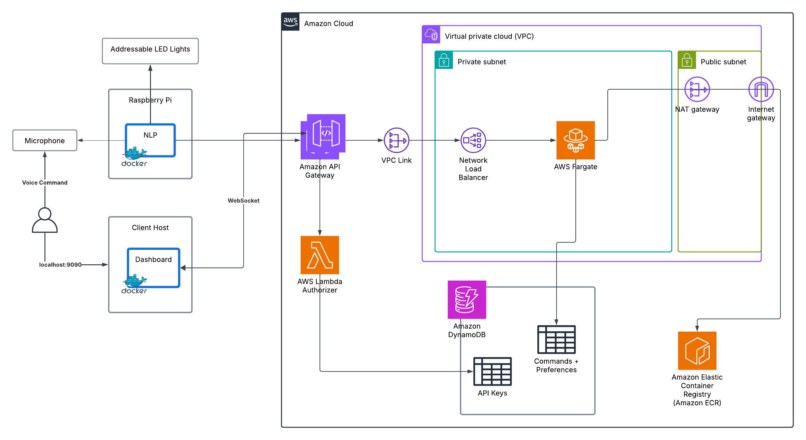

# Voice Hue

## Overview
Voice Hue is a voice-controlled LED light system that uses natural language processing to interpret commands. The system is composed of a FastAPI backend that stores settings, a Raspberry Pi client app that controls NeoPixel LEDs, and a web dashboard that visualizes the command history.

## Architecture



## Visuals
> "Alternate an intense purple with a long bright green"


### Technologies
- [FastAPI](https://fastapi.tiangolo.com/)
- [Spacy](https://spacy.io/)
- [Docker](https://www.docker.com/)
- [Terrafom](https://www.terraform.io/)
- [AWS](https://aws.amazon.com)
- [NeoPixel LEDs](https://www.adafruit.com/category/168)
- [Alpine.js](https://alpinejs.dev/)
- [d3.js](https://d3js.org/)


## Development

### Requirements
- Docker
- awscli
- pre-commit
- Raspberry Pi with NeoPixel LEDs and a microphone

### Setup
To configure environment variables, copy the `.env.local` file to `.env` and fill in the necessary values.

To run the API and dashboard:
```
docker compose --profile local up --build
```

To run the client on a Raspberry Pi:
```
docker compose --profile rpi up --build
```

LocalStack is used to mock out AWS services (DynamoDB) for local development of the API. After starting up the docker containers, run the following script to initialize necessary data in LocalStack.

```
scripts/init-localstack.sh
```

To install (using brew) and configure pre-commit for linting and formatting hooks:
```
brew install pre-commit
pre-commit install
```

The required AWS infrastructure which is managed outside of terraform is:
- ECR repository for the FastAPI image
- S3 bucket for terraform remote state
- IAM role with permissions for provisioning terraformed resources